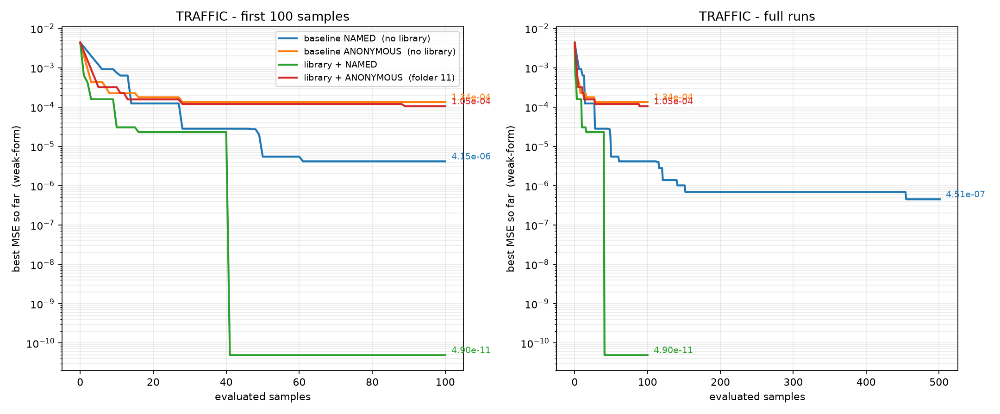

# 交通（Traffic_Flow_Bottleneck）：四个方法的结果对比

同一个问题、同一份数据、同一个模型（deepseek-v4-flash），只改"给不给变量名"和
"给不给机制库"两件事，看结果差多少。



---

## 一、四个方法的定义与数据

| 方法 | 代码 | 搜索语言 | 变量 | 库 | 样本 | 有效评估 | **最好 MSE** | 复杂度 |
|---|---|---|---|---|---|---|---|---|
| **基线 实名** | `03_实验结果输出` | 原版（`d_dx` + 自由 numpy） | 告知 | 无 | 501 | 389 | **4.5137e-07** | 40 |
| **基线 匿名** | `01_原版复现/logs/baseline_anonymous_100` | 原版 | 隐藏 | 无 | 101 | 92 | **1.3360e-04** | 27 |
| **有库 实名** | `10_LLM设计机制库` | 机制文法（`G.<name>`） | 告知 | 有（6 条） | 101 | 93 | **4.9042e-11** | 18 |
| **有库 匿名** | `11_匿名LLM定统计` | 机制文法 | 隐藏 | 有（9 条） | 101 | 95 | **1.0477e-04** | 22 |

前 100 样本窗口内的最好值：实名基线 **4.149e-06**，匿名基线 **1.336e-04**，
有库实名 **4.904e-11**，有库匿名 **1.048e-04**。

数据来源：`results/<方法>/`（每方法放了 `final_pareto_front.json` 或 `pareto_front_clean.json`
＋逐样本历史 ＋ 该方法的设计库）。

---

## 二、四条方法各自找到的最优方程（原文）

**基线 实名**（4.51e-07，cx 40）
```python
bottleneck = 1 + params[3] * np.tanh(x * params[4])
flux = u * (1 - u) * bottleneck
advection = -d_dx(flux, order=1)
relative_gradient = d_dx(u / (1 + u), order=1)
anticipation = params[0] * d_dx((1 - u) * relative_gradient, order=1)
nonlinear_diffusion = params[1] * d_dx(u * u_x, order=1)
bottleneck_diffusion = params[2] * d_dx(bottleneck * u_x, order=1)
```
→ **结构对了**：有 `u(1−u)` 通量、有 `tanh(x)` 瓶颈、有前视项。但注意它把 tanh 写成
`1 + p·tanh(x·q)` 再乘进通量，且"前视"写成 `d_dx((1−u)·d_dx(u/(1+u)))`，与真解
`∂ₓ(uₓ/u)` 不完全同形。

**基线 匿名**（1.336e-04，cx 27）
```python
u_t_pred = (params[0]*u_xx + params[1]*u_x
            + params[2]*u*u_x + params[3]*u*u_xx + params[4]*u*u*u)
```
→ 就是"扩散 + 平流 + Burgers + 浓度依赖扩散 + 三次反应"这套通用模板。
**没有位置依赖、没有瓶颈、没有前视项。**

**有库 实名**（4.904e-11，cx 18）
```python
flux = G.MUL(f1, (1 - f1))                                   # u(1-u)
advection = G.prs(flux, 0)                                   # ∂[u(1-u)]
rel_grad_diff = G.prs(G.DIV(G.prs(f1, 0), f1), 0)            # ∂[(u_x)/u]
bottleneck_flux = G.MUL(flux, G.coord('tanh', 1.0, 0, 0))    # u(1-u)*tanh(x)
```
→ **与真解逐项一致**（tanh 频率就取在 1.0）。

**有库 匿名（11）**（1.048e-04，cx 22）
```python
f1_t_pred = (params[0]*G.dif(f1)                              # 扩散
           + params[1]*G.prs(G.cpl(f1, f1), 0)                # 非线性平流（Burgers）
           + params[2]*G.prs(f1, 0)                           # 线性平流
           + params[3]*G.cpl(G.coord_sin(0.1,0,0), G.prs(f1,0))
           + params[4]*G.cpl(G.coord_cos(0.2,0,0), f1))
```
→ 两者都是真解项的**近似替身**：用 `f²` 代替 `f(1−f)`（少了线性项）；
用 `sin(x)/cos(x)` 代替 `tanh(x)`，而且频率 0.1/0.2 是猜的；
**完全缺 `∂ₓ(fₓ/f)` 这一项**。

---

## 三、读数

1. **只有"实名 + 库"离开了 1e-4 这条线**：4.904e-11。
   相对实名基线（4.51e-07）好 **9,200×**；相对匿名基线（1.336e-04）好 **7 个数量级**。
2. **匿名 + 库几乎没有收益**：1.048e-04 vs 匿名基线 1.336e-04，只好 **1.27×**。
   同一个库，给了变量名值 6 个数量级，藏起来值 1.27 倍。
3. **实名 → 匿名（无库）只退化 32×**（4.15e-06 → 1.336e-04）；
   **实名 → 匿名（有库）退化 6 个数量级**（4.90e-11 → 1.05e-04）。
   也就是说：**库放大的不是"信息"，是"变量名带来的机制信息"**——有名字时它乘 10^4，
   没名字时它乘 1.3。
4. **骨架层面**：实名+库给出的是真解本身；匿名+库给出的是"同族但错形状、缺一项"的
   近似（f² 代 f(1−f)、sin/cos 代 tanh、缺相对梯度）。

---

## 四、这次的匿名方法**不是**因为塌缩才差（关键）

之前 v6 / v8 两版匿名方法的问题之一是搜索塌缩（100 个样本只有 17 / 24 个不同式子，
同一个式子重复 82 / 32 次）。**11 这一版没有塌缩**：

| 方法 | 有效评估 | 不同式子数 | 单一式子最多重复 | 复杂度范围 | 同提示词 4 个样本全同的组 |
|---|---|---|---|---|---|
| 基线 实名 | 389 | 358 | 18 | 4..57 | 0 / 98 |
| 基线 匿名 | 92 | 89 | 2 | 4..31 | 0 / 23 |
| 有库 实名 | 93 | 91 | 2 | 3..32 | 0 / 24 |
| **有库 匿名（11）** | **95** | **95** | **1** | 3..25 | **0 / 24** |

**95 个有效样本 → 95 个互不相同的式子，最大重复 1 次。**
所以 11 的 1.048e-04 是"探索充分下的真实成绩"，不能归因于没跑开。
（反过来，v6/v8 那两版因为塌缩，**不能用来评价库本身**。）

---

## 五、前提

1. **单次运行**：每方法只有一次，没有重复种子。
2. **样本数不齐**：实名基线跑了 500 样本（389 个有效评估），其余三方法各 100 样本
   （92–95 个有效评估）。左图取前 100 样本是为了可比；右图里只有实名基线延伸到了 500。
3. **模型相同**：四方法都是 `deepseek-v4-flash`。

---

## 六、目录

```
15_交通四方法对比/
├── 结果分析_交通四方法.md          ← 本文
├── code/                        ← 匿名方法（folder 11）的完整代码
├── data/                        ← traffic_flow_bottleneck.npz
├── results/
│   ├── baseline_named/          ← 原版语言、告知变量、无库（500 样本）
│   ├── baseline_anonymous/      ← 原版语言、隐藏变量、无库（100）
│   ├── library_named/           ← 机制文法、告知变量、有库（100）
│   └── library_anonymous_11/    ← 机制文法、隐藏变量、有库（100）
└── diagnostics/
    ├── plot_four_arms.py        ← 画图脚本（四条曲线）
    └── traffic_four_arms.png    ← 图
```
