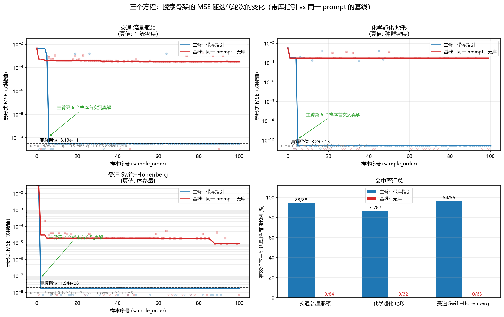
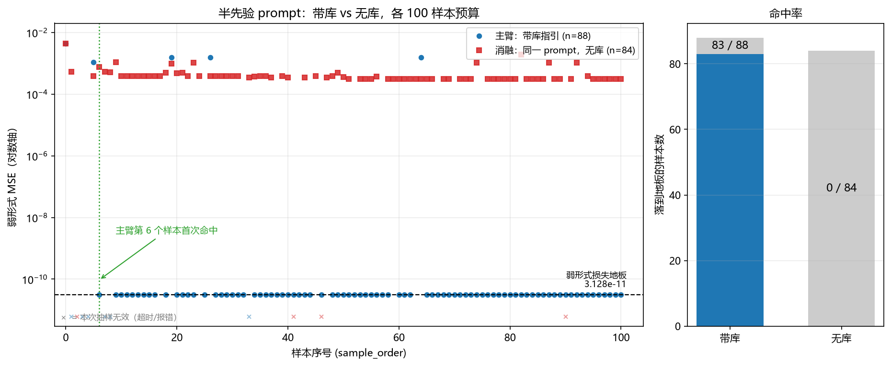
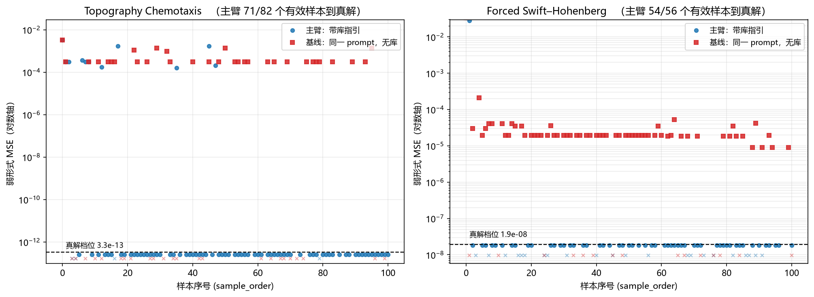
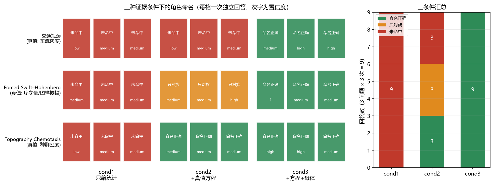

# 带少量先验的 LLM-PDESR

半匿名的物理引导方程发现：**保留一些物理先验，但是匿名掉学科名词**；搜索结束后，再由
"最优方程 → 经典母体 → 继承其符号语义"推断变量角色。
[方法框架](./方法框架.png)

一句话结论：**在三个不同学科的问题上，带上这份库指引的搜索都在前几个样本内落到
真解，把库去掉、其余条件完全相同的基线一次都没到。**

## 一、方法

```
spec（结构先验，无学科名词）
   │
   ├ 1 库设计   LLM 只读先验 → 提 ≤10 条机制（JSON 表达式树）
   │           我们编译 + 在数据上实例化验证，通过的才入库
   │           → results_design*/designed_library.json
   │
   ├ 2 搜索     库作为"宏观方向"（guidance，不是 API）
   │           LLM 用 numpy 自由写方程 → 弱形式损失 → Pareto 前沿
   │           → results_*_main|base/final_pareto_front.json（含拟合出的 params）
   │
   └ 3 角色识别 证据1：统计量读出的宏观角色（独立于先验）
               证据2：最优方程 + 拟合系数 + 它匹配上的经典母体 PDE
               → results_*_main/role_identification.json
```

两个刻意的设计：

- **先验全局可见**：库设计与搜索看到的是同一段文字，不存在"搜索知道、库不知道"。
- **库是方向不是接口**：搜索侧写自由 numpy，库只按优先级告诉它该往哪些结构上试


## 二、三个问题

| 问题 | 真值方程 | f1 真值角色 | 先验长度 | MAX_NPARAMS |
|---|---|---|---|---|
| 交通流瓶颈 | `u_t = -d/dx[u(1-u)(1-0.5 tanh x)] + 0.05 d/dx(u_x/u)` | 车流密度 | 1296 | 5 |
| 地形化学趋化 | `u_t = 0.1 u_xx - 0.5 d/dx[u(1-u) cos x] + u(1-u)` | 种群密度 | 930 | 5 |
| 受迫 Swift–Hohenberg | `u_t = 1.5 exp(-0.1x²)u - 2u_xx - u_xxxx - u³ + u⁵` | 序参量 | 1112 | 6 |


先验里不出现任何学科名词（traffic / road / vehicle / density / population /
optical / laser / Swift-Hohenberg / pattern … 全部 0 命中）。

## 三、结果一：方程搜索（每格 100 样本预算，各跑一次）

| 问题 | 臂 | 抽出 | 有效 | 最好 MSE | 到达真解档的样本 |
|---|---|---|---|---|---|
| 交通 | **主臂（带库）** | 94 | 88 | **3.128e-11** | **83（94%）** |
| 交通 | 基线（同先验，无库） | 88 | 84 | 3.158e-04 | 0 |
| 化学趋化 | **主臂（带库）** | 86 | 82 | **2.561e-13** | **71（87%）** |
| 化学趋化 | 基线 | 56 | 32 | 3.008e-04 | 0 |
| Swift–Hohenberg | **主臂（带库）** | 78 | 56 | **1.807e-08** | **54（96%）** |
| Swift–Hohenberg | 基线 | 78 | 63 | 8.976e-06 | 0 |

收敛过程（best-so-far，首次触到真解的那一轮）：

```
交通     4.39e-3 → 1.10e-3 → 3.13e-11（第 6 个样本）→ 之后一直贴地板
化学趋化 3.29e-3 → 3.07e-4 → 3.07e-4 → 3.31e-13（第 5 个样本）→ 一直贴地板
SH      3.40e-2 → 2.82e-2 → 1.81e-08（第 2 个样本）→ 一直贴地板
```

三条基线曲线则各自平在离地板 6–8 个数量级的地方（3.2e-4 / 3.0e-4 / 9.0e-6），
合计 179 个有效样本，**一个真解档都没有**。



## 四、结果二：角色识别

三个主臂的角色识别都命中真值，且拟合系数就是真值：

| 问题 | 判出的变量 | 母体 | 学科 | 置信 | 拟合系数 vs 真值 |
|---|---|---|---|---|---|
| 交通 | traffic density（单车道瓶颈路段） | Lighthill-Whitham-Richards + bottleneck/anticipation | 交通流理论 | **high** | `[0.5, 1, 1, 0.05, 1]` = 真值 |
| 化学趋化 | population fraction（周期性环境中扩散的物质/种群） | Convective Fisher-KPP | 数学生物 / 种群动力学 | **high** | `[0.1, 0.5, 1.0, 1.0, -π/2]` = 真值（相位 −π/2 给出 `cos`） |
| Swift–Hohenberg | order parameter（图样振幅） | Swift–Hohenberg + 五次稳定项 + 高斯势 | Physics | **high** | `[1.5007, 0.0997, −1.9966, −0.9975, −1.0000, 0.9999]` = 真值 |

命名链条是：**统计量只能定到"某个非负标量场的输运" → 方程定死结构 → 母体把名字定死**。

## 五、消融

### 5.1 搜索消融：库到底有没有用

两臂的 prompt 只差库那一段（逐字节验证过：把主臂 prompt 里的引导段删掉，得到的就是
基线 prompt），数据、模型、采样设置、样本预算全部相同。

结构层面的逐条统计（在有效样本里数）：

| 结构标记 | 主臂（带库） | 基线（无库） |
|---|---|---|
| 交通：平流写成守恒形式 `∂ₓ(f1·speed)` | **87 / 88（99%）** | **0 / 84（0%）** |
| 化学趋化：同上 | **78 / 82（95%）** | **0 / 32（0%）** |
| Swift–Hohenberg：钟形增益 + u_xx + u_xxxx + u⁵ 四项齐全 | 54 / 56（96%） | 60 / 63（95%） |

交通与化学趋化是**结构上的分水岭**：基线一次都没写出守恒形式（`∂ₓ(f1·速度)`），
而库的第一条机制写的正是 `D(f1·(1−a·tanh(kx))·(1−b·f1), axis, 1)`。

SH 的差别更细——两臂写出的**项**几乎一样，差别在**系数是否各自独立**：

```python
主臂 rank1 (1.81e-08):  p0·exp(-p1·x²)·f1 + p2·u_xx + p3·u_xxxx + p4·u³ + p5·u⁵
基线 rank1 (8.98e-06):  p0·exp(-p1·x²)·f1 + p2·u_xx − p3·u_xxxx − p4·(f1 − p5·u³ + u⁵)
```

基线那条把 u³ 与 u⁵ 的系数绑在同一个 `p4` 上（还多出一个线性项），所以无论怎么拟合
都出不了真值的那组独立系数；库里的机制是以 `c3·u³ + c5·u⁵` 这种**独立形参**形式给出的。




### 5.2 角色识别消融：名字是从哪一路证据来的

同一个问题、同一个模型、三档证据（每档每问题 3 次，共 27 次回答）。同一问题内部，
统计块与任务文本**逐字节相同**，只差中间插的证据块：

| 条件 | 给的东西 | 命名正确 | 只对族 | 未命中 |
|---|---|---|---|---|
| cond1 | 只给统计量 | **0 / 9** | 0 | 9 |
| cond2 | 统计量 + 真值方程 | **3 / 9** | 3（全是 SH） | 3 |
| cond3 | 统计量 + 真值方程 + 母体 | **9 / 9** | 0 | 0 |

分题：交通 0 → 0 → 3；Swift–Hohenberg 0 → 0（族 3/3 认对）→ 3；化学趋化 0 → 3 → 3。

结论：**命名能力来自"方程 → 经典母体"这一跳**。统计量跨学科不可分；方程能定死结构，
但结构相同的族在多个学科里长得一样（交通那条连族都没认出来，SH 认出了族却不肯说量名）；
只有把方程映射回经典母体、再读它约定的符号语义，名字才定下来。详见
[`消融_角色识别/README.md`](./消融_角色识别/README.md)。




## 六、目录与运行

```
带少量先验的LLMPDESR/
  code/                     7 个模块 + 3 份 spec + run.ps1
  data/                     traffic_flow_bottleneck.npz / chemotaxis.npz / swift_hohenberg.npz
  results_design*/          三份设计出来的库（9 / 9 / 10 条机制）
  results_main/             交通主臂（100 样本 + 角色识别）
  results_chemotaxis_{main,base}/    化学趋化：主臂 / 基线
  results_swift_hohenberg_{main,base}/  Swift–Hohenberg：主臂 / 基线
  消融_基线_同prompt/        交通的基线臂（同一 prompt，无库）+ 主臂 vs 消融的对照
  消融_角色识别/             角色识别三条件消融（脚本、证据、prompt、结果、图）
```

```powershell
cd code
pwsh run.ps1 -DesignOnly 1 -Spec spec_chemotaxis.txt -Data data\chemotaxis.npz `
             -DesignMechanisms 10 -MaxOrder 2 -LogDir ..\results_design_chemotaxis
pwsh run.ps1 -Spec spec_chemotaxis.txt -Data data\chemotaxis.npz `
             -DesignFrom ..\results_design_chemotaxis\designed_library.json `
             -MaxSamples 100 -MaxOrder 2 -LogDir ..\results_chemotaxis_main
pwsh run.ps1 -Spec spec_chemotaxis.txt -Data data\chemotaxis.npz -Design false `
             -RoleIdentify false -MaxSamples 100 -LogDir ..\results_chemotaxis_base
```

需要仓库根目录 `.env` 里的 `TEAMOROUTER_API_KEY`。基线臂就是 `-Design false`（不设计库、
提示里没有 guidance 段），其余参数与主臂相同。

## 八、公平性与局限

- **主臂 vs 基线**：同一 spec、同模型、同样本预算，prompt 只差库那一段（逐字节验证）。
  限制：每臂一次运行，无种子控制；而且**基线的有效率偏低**（化学趋化 57%、SH 81%、
  交通 95%），主要原因不是物理而是模型回复里没有可执行体（UNPARSABLE）。不过结论不依赖
  这一点：三个基线合计 179 个有效样本，全部停在各自的平台上（3.2e-4 / 3.0e-4 / 9.0e-6），
  一个真解档都没有；分离在结构层（守恒形式 95–99% vs 0%）与结果层（87–96% vs 0%）都很干净。
- **角色识别消融**：三条件共用同一份统计块（逐字节相同）与同一段任务文本，只差中间
  证据块。限制：三条件长度不等、新证据块总在末尾（近因优势）；每条件 3 次；判分是人工读的
  （规则写在 `消融_角色识别/score_and_plot.py` 的 `VERDICT` 里，可对照 `ablation_all.json` 复核）。
- **母体是模型自己给的**：`parents_prompt` 里没有任何族名示例、没有数据集名（已扫描确认），
  但同模型既提候选又读符号表，属于闭环。缓解：term mapping 可机械核对（代入后是恒等式）；
  交通那条用干净数学式做过独立对照，照样召回 LWR。
- **方法的适用范围**：它只能命名"能用某个经典 PDE 族解释"的场；如果真值没有经典母体、
  或模型记错了某族的符号约定，它会给出结构自洽但错误的答案。能力上界 = 模型的经典族库。
